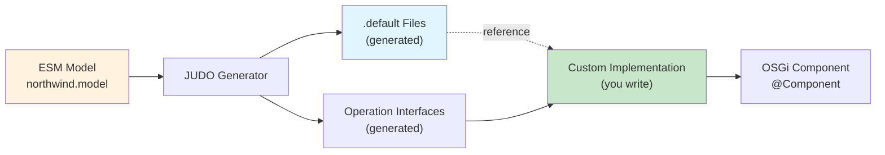

# Custom Operations

> [!IMPORTANT]
> **Prerequisites**
>
> Before diving into custom operations, it is highly recommended that you familiarize yourself with two core concepts:
>
> - **[The Two-Layer Type System](type-system-guide.md)**: Understanding the difference between the Service and Entity layers is critical to avoid common compilation errors.
> - **[Data Access and Masks](data-access-guide.md)**: Efficient data fetching is key to performance. This guide covers how to use DAOs and masks effectively.

## Understanding Generated Default Implementations

**⚠️ CRITICAL: NEVER EDIT `.default` FILES**

The `.default` files are **READ-ONLY BLUEPRINTS** generated by the JUDO framework. They serve as reference templates only.

**DO NOT:**
- ❌ Edit `.default` files directly
- ❌ Rename `.default` files
- ❌ Copy and modify `.default` files in place
- ❌ Commit modified `.default` files

**WHY:**
- `.default` files are regenerated on every build
- Any manual changes will be overwritten
- Editing them will cause build failures
- They are blueprints, not implementations

**INSTEAD:**
- ✅ Create a new `.java` file (without `.default` extension)
- ✅ Use the `.default` file as a reference/template
- ✅ Add the `.default` file path to `.generator-ignore`
- ✅ Implement your custom logic in the new `.java` file

---

**IMPORTANT**: The JUDO code generator creates `.default` files for all customizable operations. These files contain the default generated implementation.

### What are `.default` Files?

When you regenerate code from the model (`./judo.sh build`), the framework generates default implementations with the `.default` extension for operations that can be customized:

```
application/app/src/main/java/.generated-files
└── [package]/
    └── operations/
        ├── CreateUserOperation.java.default
        ├── CreateCampaignOperation.java.default
        ├── InitAdminUserOperation.java.default
        └── ...
```

### How to Use `.default` Files

**Before customizing an operation:**

1. **Check the `.default` file first** - It shows what the generator would create automatically
2. **Review the generated interface** - Understand method signatures, parameters, return types
3. **Identify what needs customization** - Compare default behavior with your requirements
4. **Create your custom implementation** - Following the patterns in the `.default` file

**Example workflow:**

```bash
# 1. Find the .default file
find application/app/src/main/java -name "*CreateUser*.default"

# 2. Review the default implementation
cat application/app/src/main/java/.generated-files/.../CreateUserOperation.java.default

# 3. Create your custom implementation based on what you learned
# (in application/app/src/main/java/[package]/operations/)
```

### When Working with AI Agents

When asking an AI agent to help customize an operation:

1. **Always mention the `.default` file location** - The agent should check it first
2. **Ask the agent to analyze** - "What does the default implementation do?"
3. **Identify customization points** - "What can I customize in this operation?"
4. **Request specific changes** - Based on understanding the default behavior

**Example prompts:**
```
"Check the .default file for CreateUser operation and tell me what can be customized"
"What's the default behavior of initAdminUser? Show me the .default implementation"
"I want to add validation to CreateCampaign - what does the .default file do?"
```

### Relationship Between `.default` Files and Custom Implementations



**Key points:**
- `.default` files are **REGENERATED** every time you run `./judo.sh build`
- Your custom implementations are **NEVER overwritten** (they're in different directories)
- `.default` files serve as **templates and reference** for what the framework expects
- Your custom implementation **overrides** the default behavior when registered as OSGi component

### Location Patterns

| File Type | Location | Regenerated? | Purpose |
|-----------|----------|--------------|---------|
| `.default` files | `application/app/src/main/java/.generated-files/<generator-package>/custom/` | YES | Reference/template |
| Generated interfaces | `application/app/src/main/java/.generated-files/` | YES | Contract definition |
| Custom implementations | `application/app/src/main/java/<generator-package>/custom/` | NO | Your customizations |

### Generator-Emitted Package Convention

> [!IMPORTANT]
> **Custom ops live in the generator's package, not a package you invent.**

The generator emits both the `.default` blueprint and the expected custom-impl location under a **fixed, model-derived package** of the form:

```
<generated-root-package>.northwind.custom
```

For this project that resolves to a path like:

```
application/app/src/main/java/<generated-root-package>/northwind/custom/
  ├── CreateUserOperation.java.default        ← generated, read-only
  └── CreateUserOperation.java                ← your custom impl (same package!)
```

**Concrete example (real project):** `hu.blackbelt.compsych.letter.compsychletter.custom/` — derived from the root package `hu.blackbelt.compsych.letter` plus the lower-cased model name `compsychletter` plus the fixed `.custom` suffix.

> [!WARNING]
> **Generator checksum gotcha — `.generated-files` can be wiped.**
>
> The build's `resetChecksum` goal periodically clears `application/app/src/main/java/.generated-files/`. After that the `.default` blueprints and the checksum registry are gone until the next full generator run — which can break incremental builds and make your `.generator-ignore` entries look orphaned.
>
> **Recovery**: restore from VCS rather than forcing a full regenerate:
>
> ```bash
> git checkout -- application/app/src/main/java/.generated-files
> ```
>
> This is the fastest way back to a consistent state. Only run the full generator if the ESM model actually changed.

**Do NOT:**
- ❌ Place custom impls in an invented package such as `com.<yourorg>.operations` or `<root>.operations` — the OSGi wiring and `@Component` discovery are keyed off the generator package.
- ❌ Keep a stale `operations/` package from an earlier design sketch; rename to `.custom/` to match the emitted `.default`.

**Do:**
- ✅ Put your `.java` file in the **same package as its `.default` twin**.
- ✅ Add the `.default` path (at its real generator-emitted location) to the root `.generator-ignore`.
- ✅ When in doubt, run `find application/app/src/main/java -name '*.java.default'` and mirror those packages.

### Best Practices

1. **Always check `.default` first** before implementing a custom operation
2. **NEVER edit `.default` files** - They are read-only blueprints that get regenerated
3. **Keep `.default` files for reference** - Don't delete them, but never modify them
4. **Compare after regeneration** - See what changed in the generator's approach
5. **Use as template** - Copy structure to a NEW `.java` file and adapt for your needs
6. **Document deviations** - Note where your implementation differs from default
7. **Add to `.generator-ignore`** - Always add the `.default` file path to the root `.generator-ignore` file

**Example Workflow:**
```bash
# 1. Review the .default file (READ ONLY)
cat application/app/src/main/java/.../CreateUserOperation.java.default

# 2. Create your custom implementation (NEW FILE without .default)
touch application/app/src/main/java/.../CreateUserCustomImplementation.java

# 3. Add .default to .generator-ignore (root level)
echo "/path/to/CreateUserCustomImplementation.java.default" >> .generator-ignore

# 4. Implement your custom logic in the .java file
```

## When to Implement Custom Operations

Implement custom operations for:
- Complex business logic not expressible in ESM
- External API integrations
- Data validation beyond basic constraints
- Computed values requiring business rules
- Multi-step transactions

## Implementation Steps

1. **Define operation in ESM model** (`/model/northwind.model`)
   - ⚠️ **Use Judo Designer tool** - DO NOT edit the XML file directly
   - Mark operation as custom/script-based
   - Define input/output parameters
   - See `../model/README.md` for model editing guidelines

2. **Regenerate code**
   ```bash
   ./judo.sh build
   # or
   mvn clean install -DskipFrontendReact
   ```

3. **Implement in `application/app/`**
   - Extend generated service interfaces
   - Implement business logic
   - Use injected DAOs for data access

4. **Build and deploy**
   ```bash
   cd application/app
   mvn install
   # If Karaf running: auto-deploys via hot deployment
   ```

## OSGi Component Registration Pattern

All custom implementations must be registered as OSGi components using the `@Component` annotation:

```java
@Component(immediate = true, service = [OperationInterface].class)
public class [OperationName]CustomImplementation implements [OperationInterface] {
    // Implementation
}
```

**Key elements:**
- `immediate = true` - Component starts immediately when bundle activates
- `service = [OperationInterface].class` - Registers implementation as OSGi service
- Implements the operation interface generated from your model

## Example 1: Simple Toggle Operation

**Pattern**: Boolean toggle with validation

```java
@Component(immediate = true, service = ToggleStatus.class)
public class ToggleStatusCustomImplementation implements ToggleStatus {

    @Reference EntityDao entityDao;
    @Reference AccessValidationDao accessValidationDao;
    @Reference VariableResolver variableResolver;

    @Override
    public void accept(Entity _this) {
        // Security check: prevent self-modification
        if (!_this.getIdentifier().equals(variableResolver.resolve(String.class, "ACTOR", "identifier"))) {
            Entity thiss = entityDao.getById(_this.identifier()).orElseThrow();
            thiss.setStatus(!thiss.getStatus());
            thiss = entityDao.update(thiss);

            // Business rule validation after toggle
            if (!thiss.getStatus()) {
                Boolean activeEntitiesWithAtLeastManagementPermission =
                    accessValidationDao.queryActiveEntitiesWithAtLeastManagementPermission().orElse(false);
                Boolean activeEntitiesWithAtLeastAdminPermission =
                    accessValidationDao.queryActiveEntitiesWithAtLeastAdminPermission().orElse(false);

                if (!(activeEntitiesWithAtLeastManagementPermission && activeEntitiesWithAtLeastAdminPermission)) {
                    throw new IllegalStateException(
                        "Maintain minimum required entities with specific permissions");
                }
            }
        }
    }
}
```

**Key patterns demonstrated:**
- `@Reference` injection for DAOs and runtime services
- `VariableResolver` for accessing current actor context
- Security validation (prevent self-modification)
- Business rule validation (ensure minimum required entities)
- Throwing exceptions to prevent invalid state

## Example 2: Complex Multi-Entity Operation

**Pattern**: Validation and recalculation across related entities

```java
@Component(immediate = true, service = ValidateEntity.class)
public class ValidateEntityCustomImplementation implements ValidateEntity {

    @Reference ParentEntityDao parentEntityDao;
    @Reference ChildEntityDao childEntityDao;

    @Override
    public void accept(ParentEntity _this) {
        // Load entity with specific mask (projection)
        ParentEntity parentEntity = parentEntityDao.getById(_this.identifier(),
                                             ParentEntityMask.parentEntityMask()
                                                        .withValidationErrors(ValidationErrorMask.validationErrorMask())
                                                        .withIsValid())
                                    .orElseThrow();

        recalculateDefaultFlagAttribute(parentEntity);

        // Clear validation errors and mark valid
        parentEntity.getValidationErrors().clear();
        parentEntity.setIsValid(true);

        parentEntity = parentEntityDao.update(parentEntity);

        // Update without fetching all fields
        parentEntityDao.update(parentEntity, ParentEntityMask.parentEntityMask());
    }

    private void recalculateDefaultFlagAttribute(ParentEntity parentEntity) {
        // Query related entities
        List<ChildEntity> childEntities = parentEntityDao.queryChildEntities(parentEntity)
                                            .maskedBy(ChildEntityMask.childEntityMask().withIsDefault())
                                            .selectList();
        Optional<ChildEntity> defaultChild = parentEntityDao.queryDefaultChild(parentEntity, ChildEntityMask.childEntityMask());

        // Update default flag on each child entity
        for (ChildEntity childEntity : childEntities) {
            boolean sameAsDefault = defaultChild.isPresent()
                && childEntity.identifier().getIdentifier().equals(defaultChild.get().identifier().getIdentifier());

            if (sameAsDefault) {
                if (!childEntity.getIsDefault()) {
                    childEntity.setIsDefault(true);
                    childEntityDao.update(childEntity, ChildEntityMask.childEntityMask());
                }
            } else if (childEntity.getIsDefault()) {
                childEntity.setIsDefault(false);
                childEntityDao.update(childEntity, ChildEntityMask.childEntityMask());
            }
        }
    }
}
```

**Key patterns demonstrated:**
- **Masks (projections)**: Only fetch needed fields using `[Entity]Mask`
- **Relationship navigation**: Using DAO query methods for relationships
- **Identifier comparison**: Proper way to check entity identity
- **Batch updates**: Update multiple related entities
- **Private helper methods**: Organize complex logic

## Example 3: External Service Integration

**Pattern**: Integrating with external APIs and data transformation

```java
@Component(immediate = true, service = SyncExternalData.class)
public class SyncExternalDataCustomImplementation implements SyncExternalData {

    @Reference ConfigurationEntityDao configurationEntityDao;
    @Reference ExternalDataEntityDao externalDataEntityDao;
    @Reference ExternalDataService externalDataService; // External service

    @Override
    public void run() {
        syncTodayExternalData();
    }

    private void syncTodayExternalData() {
        LocalDate todayDate = TemporalUtils.dateNow();

        // Query entities with filters
        List<ConfigurationEntity> configurations = configurationEntityDao.query()
            .filterByCode(StringFilter.notEqualTo("BASE_CONFIG"))
            .selectList();

        // Collect configurations needing updates
        List<String> absentConfigCodes = new ArrayList<>();
        for (ConfigurationEntity config : configurations) {
            ExternalDataEntity externalData = getConfigExternalDataOnDay(todayDate, config.getCode());

            if (externalData == null || externalData.getRecordingMethod() == RecordingMethod.MANUAL) {
                absentConfigCodes.add(config.getCode());
            }
        }

        Collection<ExternalRecord> records = null;

        try {
            // Call external service
            records = externalDataService.getCurrentRecords(absentConfigCodes)
                .getRecords()
                .get(todayDate);
        } catch (RuntimeException e) {
            throw new RuntimeException("Unable to query external data", e);
        }

        if (records == null) {
            return;
        }

        Optional<ConfigurationEntity> baseConfig = configurationEntityDao.query()
            .filterByCode(StringFilter.equalTo("BASE_CONFIG"))
            .selectOne();

        if (baseConfig.isEmpty()) {
            return;
        }

        LocalDateTime timeStampNow = TemporalUtils.timestampNow();

        // Create external data records from external source
        for (ExternalRecord record : records) {
            Optional<ConfigurationEntity> config = configurationEntityDao.query()
                .filterByCode(StringFilter.equalTo(record.getCode()))
                .selectOne();

            if (config.isEmpty()) {
                continue;
            }

            externalDataEntityDao.create(ExternalDataEntityForCreate.builder()
                    .withDate(todayDate)
                    .withSource(config.get())
                    .withTarget(baseConfig.get())
                    .withValue(record.getValue())
                    .withUnit(BigDecimal.valueOf(record.getUnit()))
                    .withRecordingMethod(RecordingMethod.AUTO)
                    .withSourceOfRecording("EXTERNAL_API")
                    .withTimestampOfRecording(timeStampNow)
                    .build());
        }
    }

    private ExternalDataEntity getConfigExternalDataOnDay(LocalDate date, String sourceCode) {
        return externalDataEntityDao.query()
                .filterByDate(DateFilter.equalTo(date))
                .filterBySourceCode(StringFilter.equalTo(sourceCode))
                .filterByTargetCode(StringFilter.equalTo("BASE_CONFIG"))
                .orderByDescending(ExternalDataEntityAttribute.TIMESTAMP_OF_RECORDING)
                .selectOne()
                .orElse(null);
    }
}
```

**Key patterns demonstrated:**
- **External service integration**: `@Reference` for OSGi service from another bundle
- **Query filters**: `StringFilter`, `DateFilter` for database queries
- **Builder pattern**: Using generated `ForCreate` builders
- **Error handling**: Try-catch with meaningful error messages
- **Ordering**: `orderByDescending()` for query sorting
- **Optional handling**: `.orElse()`, `.isEmpty()` patterns

## Example 4: Delegated Implementation with Dependency Injection Bridge

**Pattern**: OSGi component delegating to POJO with extensive dependencies

This pattern is useful when you want to separate OSGi concerns from business logic, or when working with complex initialization logic.

```java
/**
 * OSGi component that implements the Init interface by delegating to DataImporter.
 * This class acts as a bridge between the OSGi service layer and the importer logic.
 */
@Component(immediate = true, service = Init.class)
public class InitCustomImplementation implements Init {

    private static final Logger log = LoggerFactory.getLogger(InitCustomImplementation.class);

    private final DataImporter importer = new DataImporter();

    @Reference
    public void setInitializerDao(InitializerDao initializerDao) {
        importer.setInitializerDao(initializerDao);
    }

    @Reference
    public void setEntityDao(EntityDao entityDao) {
        importer.setEntityDao(entityDao);
    }

    @Reference
    public void setConfigurationDao(ConfigurationDao configurationDao) {
        importer.setConfigurationDao(configurationDao);
    }

    @Reference
    public void setReferenceDataDao(ReferenceDataDao referenceDataDao) {
        importer.setReferenceDataDao(referenceDataDao);
    }

    @Reference
    public void setMasterDataDao(MasterDataDao masterDataDao) {
        importer.setMasterDataDao(masterDataDao);
    }

    @Reference
    public void setLookupDataDao(LookupDataDao lookupDataDao) {
        importer.setLookupDataDao(lookupDataDao);
    }

    // ... more DAO injections ...

    @Reference
    public void setRecalculateRelatedData(RecalculateRelatedData recalculateRelatedData) {
        importer.setRecalculateRelatedData(recalculateRelatedData);
    }

    @Override
    public void run() {
        log.info("InitCustomImplementation delegating to DataImporter");
        importer.run();
    }
}
```

**Key patterns demonstrated:**
- **Delegation pattern**: OSGi component delegates to POJO
- **Method injection**: Using setter methods with `@Reference` (alternative to field injection)
- **Pass-through injection**: Injecting OSGi services and passing them to delegate
- **Clean separation**: OSGi concerns separated from business logic
- **Multiple operation references**: Injecting other custom operations (like `RecalculateRelatedData`)

**When to use this pattern:**
- Complex initialization logic that's easier to test as POJO
- Multiple implementations sharing common logic
- When you want to unit test business logic without OSGi container
- Large number of dependencies makes OSGi component noisy


## Testing Custom Operations

Custom operations should be thoroughly tested using **integration tests** with the JUDO Runtime Core Testkit.

### Quick Start: Integration Testing

The `application/integration-test` project provides a complete testing framework for custom operations:

```java
import hu.blackbelt.judo.runtime.core.guice.testkit.fixture.*;
import hu.blackbelt.judo.runtime.core.guice.testkit.util.ReferenceInjector;
import org.junit.jupiter.api.Test;

import static org.junit.jupiter.api.Assertions.*;

class CustomOperationTest {

    @Test
    @JudoTest(
        modelName = "yourmodel",                       // Your model name
        dialect = "hsqldb",
        transaction = TransactionHandling.AUTO_COMMIT,
        truncateTables = true,
        modelSource = JudoTest.ModelSource.CLASSPATH,
        modules = { YourProjectDaoModules.class }      // Your DAO modules
    )
    void testCustomOperation(JudoRuntimeFixture fixture) {
        // Inject @Reference dependencies into custom implementation
        // Replace with your actual custom implementation class
        YourCustomImplementation customOp = ReferenceInjector.createAndInject(
            YourCustomImplementation.class,
            fixture.getInjector()
        );

        // Get DAOs for verification
        EntityDao entityDao = fixture.getInjector().getInstance(EntityDao.class);

        // Create input (replace with your input type)
        CustomOperationInput input = CustomOperationInputForCreate.builder()
            .withFieldOne("value1")
            .withFieldTwo("value2")
            .build();

        // Execute custom operation
        Result result = customOp.accept(input);

        // Verify results
        assertNotNull(result);
        assertEquals("value1", result.getFieldOne());
        assertEquals(1, entityDao.countAll());
    }
}
```

### Key Testing Features

1. **ReferenceInjector** - Automatically injects `@Reference` dependencies into custom implementations
2. **@JudoTest Annotation** - Configures database, transactions, and model loading
3. **Transaction Modes** - AUTO_ROLLBACK (default), AUTO_COMMIT, MANUAL, NONE
4. **Table Truncation** - Clean database before each test
5. **Full DAO Access** - Test with real database operations

### Running Integration Tests

```bash
# Important: Tests are in a separate project, not a submodule
cd /path/to/your/project/application/integration-test

# Build application first (required for model and DAOs)
cd /path/to/your/project
mvn clean install -DskipTests

# Run tests
cd application/integration-test
mvn test

# Run specific test
mvn test -Dtest=YourOperationTest

# Run specific method
mvn test -Dtest=YourOperationTest#testYourOperation
```

### Testing Patterns

**Test Success Case**:
```java
@JudoTest(transaction = TransactionHandling.AUTO_COMMIT)
void testOperationSuccess(JudoRuntimeFixture fixture) {
    // Execute and verify successful operation
}
```

**Test Validation Failures**:
```java
@JudoTest(transaction = TransactionHandling.AUTO_ROLLBACK)
void testValidationFailure(JudoRuntimeFixture fixture) {
    assertThrows(IllegalArgumentException.class, () -> {
        // Execute with invalid input
    });
}
```

**Test Idempotency**:
```java
@JudoTest(transaction = TransactionHandling.NONE)
void testIdempotency(JudoRuntimeFixture fixture) {
    operation.run();
    long countAfterFirst = dao.countAll();

    operation.run(); // Run again
    long countAfterSecond = dao.countAll();

    assertEquals(countAfterFirst, countAfterSecond);
}
```

**Test with Savepoints** (for error recovery):
```java
@JudoTest(transaction = TransactionHandling.MANUAL)
void testBatchImportWithErrorRecovery(JudoRuntimeFixture fixture) {
    fixture.beginTransaction();
    try {
        for (Item item : items) {
            Object savepoint = fixture.createSavePoint();
            try {
                dao.create(item);
            } catch (Exception e) {
                fixture.rollbackToSavePoint(savepoint);
                // Continue with next item
            }
        }
        fixture.commitTransaction();
    } catch (Exception e) {
        fixture.rollbackTransaction();
    }
}
```

### Complete Documentation

For comprehensive integration testing documentation, including:
- Project setup and dependencies
- All @JudoTest parameters
- Transaction management strategies
- ReferenceInjector deep dive
- Testing all custom operations
- Advanced patterns (CSV imports, batch operations)
- Troubleshooting guide

**See**: Integration Testing Guide (see `judo-integration-testing-docs` skill)

---

## See Also

- [Data Access Guide](data-access-guide.md) - For patterns on querying, filtering, and using masks.
- [Type System Guide](type-system-guide.md) - For understanding the Service vs. Entity layer types.
- [Patterns and Best Practices](patterns-and-best-practices.md) - For other common backend patterns and utilities.
- [Interceptors](interceptors.md) - For implementing cross-cutting concerns.
- Integration Testing (see `judo-integration-testing-docs` skill) - For how to test your custom operations.
