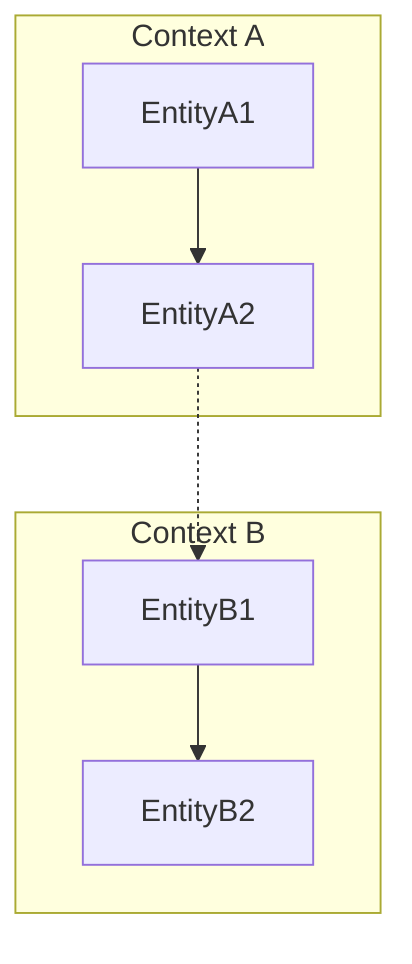

# Domain Model Guide

This guide provides a comprehensive overview of the application's domain model, organized by layer and bounded context.

## Purpose

The northwind is a **model-driven application** that serves a specific business purpose. This document outlines the core entities, relationships, and business rules that make up the domain model.

## Documentation Structure

### Purpose of Each Document

| Document | Purpose | Update Frequency |
|---|---|---|
| **domain-overview.md** | Provides a high-level overview of the business context, architecture, and ER diagrams. | When major model restructuring occurs. |
| **entity-reference.md** | Contains detailed specifications for each entity, including attributes and relationships. | When entities, attributes, or relationships change. |

## Domain Model Principles

### Model-Driven Architecture
The entire application is generated from a single Editor Specific Model (ESM) defined in:
```
/model/northwind.model
```

This model is the single source of truth for:
- Entity structures and relationships
- Data types and enumerations
- Transfer objects for the service layer
- UI forms, tables, and views
- Access control and actor types

### Read-Only Entities
All entities at the entity layer are configured with `createable="false"`, `updateable="false"`, and `deleteable="false"`. This enforces that all mutations occur through the service layer using command/input DTOs, following CQRS principles.

### Bounded Contexts

The domain is organized into distinct bounded contexts, each representing a specific area of the business domain.



## Quick Reference

### Core Entities by Context

| Context | Entities |
|---|---|
| **Context A** | EntityA1, EntityA2 |
| **Context B** | EntityB1, EntityB2 |

### Key Enumerations

| Enumeration | Values | Purpose |
|---|---|---|
| **Status** | ACTIVE, INACTIVE | Represents the status of an entity. |

### Relationship Patterns

| Pattern | Example | Description |
|---|---|---|
| **Hierarchy** | Parent -> Child | Represents a hierarchical relationship. |
| **Association** | EntityA <-> EntityB | Represents a many-to-many association. |

## Key Design Patterns

### 1. Derived Attributes
The model makes heavy use of calculated/derived fields to avoid data duplication and ensure consistency.
```
EntityA.derivedField = EntityA.field1 + " " + EntityA.field2
```

### 2. Event Sourcing
Events are used to capture all changes to the application state as a sequence of immutable events.
- **Temporal data** (eventDateTime)
- **Creator attribution** (createdBy)
- **Contextual data**

## Service Layer Overview

### Actor Type
- **Actor** (Realm: `DEFAULT`)
  - Human users authenticated via an identity provider.

### Transfer Object Pattern
For each entity, the service layer provides:
- **Query DTO** for read operations (e.g., `Address`)
- **Command DTO** for write operations (e.g., `CreateAddressInput`)

This separation supports CQRS (Command Query Responsibility Segregation).

## Model Transformation Pipeline

```
ESM (northwind.model)
    ↓
PSM (Platform Specific Model)
    ↓
ASM (Architecture Specific Model)
    ↓
┌─────────┬──────────┬───────────┐
│ Backend │ Frontend │ Database  │
│  Java   │  React   │  Schema   │
└─────────┴──────────┴───────────┘
```
See `@AGENTS.md` for a detailed explanation of the transformation pipeline.

## Domain Constraints

### Business Rules
1. **Uniqueness**: Certain fields must be unique across all instances of an entity.
2. **Referential Integrity**: Relationships between entities are enforced to ensure data consistency.

### Data Quality
- **Required Fields**: Enforce data completeness.
- **Derived Attributes**: Maintain consistency by calculating values from a single source of truth.

## Updating Domain Documentation

### When to Update

Update the domain documentation when:
- ✅ A new entity is added to the model.
- ✅ An entity's attributes or relationships change.
- ✅ The database schema changes (after a migration).
- ✅ Bounded contexts are reorganized.
- ✅ Business rules change.

### How to Update

**Option 1: Manual Update** (for small changes)
1.  Identify what changed in the model (`git diff application/model/src/main/resources/*.model`).
2.  Update `entity-reference.md` with the new or modified entity information.
3.  Update `domain-overview.md` with any changes to ER diagrams or bounded contexts.

**Option 2: Semi-Automated Update** (using the template)
1.  Build the model to generate the Liquibase changelog (`cd application/model && mvn clean install`).
2.  Use the extraction patterns from `domain-documentation-template.md` to get entity and schema information.
3.  Generate Mermaid diagrams and update the relevant documentation files.

## Usage Guidelines for AI Agents

### When Working with the Domain

1.  **Consult the Model**: Always refer to `/model/northwind.model` as the single source of truth.
2.  **Respect Bounded Contexts**: Adhere to the established context boundaries when adding or modifying features.
3.  **Use Derived Attributes**: Avoid duplicating data that can be calculated.
4.  **Use the Service Layer**: All mutations must go through command DTOs, not the entity layer.

### Model Changes

> [!IMPORTANT]
> **Do NOT edit the model file directly!**
>
> Model changes must be made using the **Judo Designer** modeling tool. When proposing model changes:
> 1.  Describe the entities, relationships, operations, and attributes to be added, modified, or removed in detail.
> 2.  Note that the model file will be updated using the Judo Designer.
> 3.  After the model changes are applied, run `./judo.sh build` to regenerate the code.

## Additional Resources

- **Model Development Guide (see `judo-model-docs` skill)**: For information on editing the ESM model with the Judo Designer.
- **Backend Guides (see `judo-backend-docs` skill)**: For backend development guides.
- **Frontend Guides (see `judo-frontend-docs` skill)**: For frontend development guides.
- **Tests:** `/tests/test_model_interrogator.py`
- **Documentation:** `/tests/README.md`
- **Quick Start:** `/tests/QUICK_START.md`
- **Examples:** `/tests/example_usage.py`
- **Summary:** `/tests/TEST_SUMMARY.md`

## Service Layer Overview

### Actor Type
- **Actor** (Realm: DEFAULT)
  - Human users authenticated via Keycloak
  - Default language: en-US
  - Managed user lifecycle

### Transfer Object Pattern
For each entity, the service layer provides:
- **Query DTO** - Read operations (e.g., `Address`)
- **Command DTO** - Create operations (e.g., `CreateAddressInput`)

This separation supports CQRS (Command Query Responsibility Segregation).

## Model Transformation Pipeline

```
ESM (northwind.model)
    ↓
PSM (Platform Specific Model)
    ↓
ASM (Architecture Specific Model)
    ↓
┌─────────┬──────────┬───────────┐
│ Backend │ Frontend │ Database  │
│  Java   │  React   │  Schema   │
└─────────┴──────────┴───────────┘
```

See `@AGENTS.md` for detailed transformation pipeline documentation.

## Domain Constraints

### Business Rules
1. **Address Uniqueness** - Each address must have unique geographic coordinates
2. **Electoral Assignment** - Every address must belong to exactly one national and one settlement electoral district
3. **Campaign Scope** - Campaigns define coverage via electoral district associations
4. **Event Attribution** - All events must be created by authenticated users
5. **Geocoding Quality** - Address geocoding quality affects map visualization and routing

### Data Quality
- Required fields enforce data completeness
- Derived attributes maintain consistency
- Geographic coordinates validated against geocoding quality
- Temporal constraints on campaign dates and event timestamps

## Updating Domain Documentation

### When to Update

Update domain documentation when:
- ✅ New entities are added to the model
- ✅ Entity attributes or relationships change
- ✅ Database schema changes (after migration)
- ✅ Bounded contexts are reorganized
- ✅ Business rules change

### How to Update

**Option 1: Manual Update** (for small changes)
```bash
# 1. Identify what changed in the model
git diff application/model/src/main/resources/*.model

# 2. Update entity-reference.md
# - Add/update entity sections
# - Update attribute tables
# - Update relationship tables

# 3. Update domain-overview.md if needed
# - Update ER diagram if relationships changed
# - Update bounded context diagrams if structure changed
```

**Option 2: Semi-Automated Update** (using template)
```bash
# 1. Build model to generate Liquibase changelog
cd application/model && mvn clean install

# 2. Use extraction patterns from domain_documentation_template.md
# - Extract entities from ESM model file
# - Extract database schema from Liquibase changelog
# - Generate entity tables and ER diagrams

# 3. See domain_documentation_template.md for:
# - Python/Bash script examples
# - XPath extraction patterns
# - Mermaid diagram generation algorithms
```

**Option 3: Fully Automated** (create custom script)
```bash
# Create a script based on the Python example in domain_documentation_template.md
python scripts/generate_domain_docs.py

# This script can:
# 1. Parse ESM model XML
# 2. Extract entity metadata
# 3. Parse Liquibase changelog
# 4. Generate Mermaid diagrams
# 5. Update entity-reference.md
```

### Using the Template for New Projects

The `domain_documentation_template.md` can be used to:

1. **Bootstrap documentation** - Start domain docs for a new JUDO project
2. **Standardize format** - Ensure consistent documentation across projects
3. **Automate updates** - Extract information from model files programmatically
4. **Maintain accuracy** - Keep documentation in sync with model changes

**Quick Start for New Project**:
```bash
# 1. Copy template to your project
cp agent-docs/domain/domain_documentation_template.md ~/my-project/agent-docs/domain/

# 2. Follow the extraction patterns to generate docs
# See "Automation Script Template" section in the template

# 3. Customize with business context
# Add manual descriptions, business rules, and context explanations
```

## Usage Guidelines for AI Agents

### When Working with the Domain

1. **Read the model first** - Always consult `/model/northwind.model` as the source of truth
2. **Follow bounded contexts** - Respect context boundaries when adding features
3. **Use derived attributes** - Avoid duplicating data that can be calculated
4. **Service layer operations** - All mutations through command DTOs, not entity layer
5. **Maintain relationships** - Preserve referential integrity in associations

### Updating Documentation

When making model changes:
1. **Check template** - Review `domain_documentation_template.md` for extraction patterns
2. **Extract new data** - Use provided patterns to get entity/attribute/relationship info
3. **Update entity-reference.md** - Add/modify entity sections
4. **Update ER diagrams** - Add new relationships to Mermaid diagrams
5. **Validate** - Use the checklist in the template to ensure completeness

### Model Changes

⚠️ **CRITICAL: Do NOT edit the model file directly!**

Model changes must be made using the **Judo Designer** modeling tool. When proposing model changes:
1. Describe entities, relationships, operations, attributes to add/modify/remove
2. Specify changes in detail (types, cardinalities, constraints)
3. Note that the model file will be updated using Judo Designer
4. After model changes, run `./judo.sh build` to regenerate code

### Backend Development
- Implement custom operations in `/application/app/`
- Use interceptors for cross-cutting concerns
- Follow patterns in Backend Guide (see `judo-backend-docs` skill)

### Frontend Development
- Customize with hooks in `src/custom/`
- Never edit generated React components
- Follow patterns in Frontend Guide (see `judo-frontend-docs` skill)

## Development Tools

### JUDO Model CLI
Java-based CLI tool for querying and mutating ESM model files. Load the `judo-model-cli` skill for detailed commands and patterns.

### Diagram Generator

The `diagram_generator.py` script in this directory can be used to generate visual diagrams of the ESM model.

**Functionality:**

-   **Parses Model Files**: Reads the `.aird` (diagram definitions) and `.model` (ESM structure) files.
-   **Generates Diagrams**: Creates a Markdown file with class diagrams for each entity diagram found.
-   **Multiple Formats**: Supports both `PlantUML` (default) and `Mermaid` diagram formats.

**How to Use:**

1.  Navigate to the root directory of the `[project-name]` project.
2.  Run the script with the following command:

    ```bash
    python agent-docs/domain/diagram_generator.py \
      representations.aird \
      application/model/target/generated-resources/model/kopogtato-esm.model \
      agent-docs/domain/generated-diagrams.md
    ```

3.  To specify the output format, use the `--format` flag:

    ```bash
    # To generate Mermaid diagrams
    python agent-docs/domain/diagram_generator.py \
      representations.aird \
      application/model/target/generated-resources/model/kopogtato-esm.model \
      agent-docs/domain/generated-diagrams.md \
      --format mermaid
    ```

The generated file, `generated-diagrams.md`, will be placed in this directory.

**Quick Test:**
```bash
./tests/run_tests.sh
```

## Additional Resources

- **AGENTS.md** - Complete project overview and quick start
- **../model/README.md** - Model editing with Judo Designer
- **../backend/** - Backend development guides
- **../frontend/** - Frontend development guides
- **../deployment/schema-evolution.md** - Database migrations

## Version Information

- **Model Version**: Defined in model metadata (`$MODEL_VERSION_PLACEHOLDER$`)
- **ESM Metamodel**: JUDO ESM v1.2.0
- **JUDO Platform**: v2.0.1

---

**Next Steps**: Explore the detailed documentation for each domain context to understand entity structures, relationships, and usage patterns.
