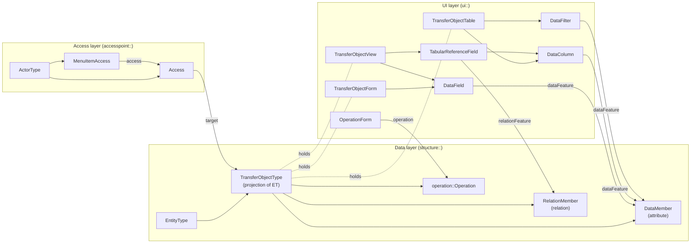
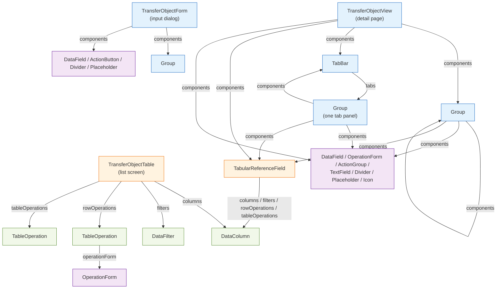
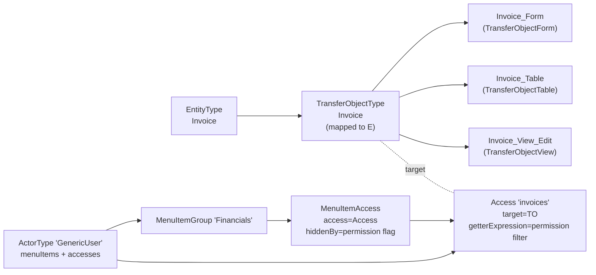

# UI Authoring Guide

**[◄ Back to Index](./SKILL.md)**

This guide is the **authoring playbook** for composing ESM UI presentations (Form, Table, View) on `TransferObjectType`s, and for wiring them onto an `ActorType` menu. It is the companion to the per-element reference in [ui.md](./esm_metamodel/ui.md).

**Scope boundary.** This file explains **what to put in the model**. For how to actually mutate the model, see the `judo-model-cli` skill. For per-element attribute definitions, enums, and conditional rules, see [ui.md](./esm_metamodel/ui.md) and [ui-behaviour.md](./esm_metamodel/ui-behaviour.md). For customizing the **generated React** once the UI model is in place, see the frontend skill.

---

## TL;DR — Invariants every authoring step must respect

1.  **Every mapped `TransferObjectType` that participates in UI scaffolds exactly three siblings:** `<form>`, `<table>`, `<view>`. These three tags are typed by **containment** on `TransferObjectType` and therefore carry **no `xsi:type`**.
2.  **`xsi:type` is required iff the containing EReference is abstract.** See the Concrete-vs-Abstract Containment table below.
3.  **Every UI leaf that shows data must bind to a `structure::` element** via `dataFeature`, `relationFeature`, `operation`, `access`, `target`, `hiddenBy`, `enabledBy`, or `requiredBy`. A UI element that binds nothing is almost certainly a mistake.
4.  **Grid is 12 columns.** Sum of sibling `col` within one horizontal row must be `≤ 12`. `row > 0`.
5.  **`hiddenBy` / `enabledBy` / `requiredBy` / `confirmationCondition` must reference a boolean `DataMember` on the owner `TransferObjectType`.** No cross-TO references.
6.  **Names are unique within a container.** Duplicate `name` on sibling components is a validation error.
7.  **Use the canonical naming convention** so generators and downstream tooling find elements reliably: `<Entity>_Form`, `<Entity>_Table`, `<Entity>_View_Edit`. In particular, **do not leave bare `View` / `Form` / `Table` names on siblings sharing a namespace** — their FQNs (`<package>::View`, `<package>::Table`, `<package>::Form`) collide across TOs and break downstream resolution. Name UI container elements `<TO>View` / `<TO>Form` / `<TO>Table` **before** adding components, because renaming after wiring forces updating every `dataFeature` / `relationFeature` / `hiddenBy` id path.
8.  **Every `Access` created on an `ActorType` that should surface in the UI must be paired with a `MenuItemAccess`** on that actor's `<menuItems>` (directly, or nested inside a `MenuItemGroup`). Creating an `Access` alone grants data permission only — it does **not** add anything to the navigation menu. If there is no menu entry, the access is API-only and invisible to end users.

---

## 1. Mental model — three layers

The UI layer is a **projection of the data layer, gated by the access layer**.



**Authoring order that avoids rework:** `EntityType` → mapped `TransferObjectType` with attributes/relations/operations → `Table` → `View` → `Form` (if needed) → `Access` → `MenuItemAccess`.

---

## 2. The three scaffolds per `TransferObjectType`

| Tag | Typed as | Purpose | When to create |
|---|---|---|---|
| `<form>` | `ui:TransferObjectForm` | Create dialog and operation-input dialog | Mapped TO with `createable=true`, or any unmapped TO used as operation input |
| `<table>` | `ui:TransferObjectTable` | List / grid screen | Every mapped TO reachable via an `Access` targeting a collection (`upper=-1`) |
| `<view>` | `ui:TransferObjectView` | Detail / view-edit page for one instance | Every mapped TO reachable via an `Access` |

All three are **singular containments** on `TransferObjectType`. That is why they carry **no `xsi:type`** — the tag itself selects the EClass.

```xml
<elements xsi:type="structure:TransferObjectType" name="Customer" ...>
  <!-- attributes, relations, operations ... -->
  <form  name="Customer_Form"       .../>   <!-- ui:TransferObjectForm  (tag-typed) -->
  <table name="Customer_Table"      .../>   <!-- ui:TransferObjectTable (tag-typed) -->
  <view  name="Customer_View_Edit"  .../>   <!-- ui:TransferObjectView  (tag-typed) -->
</elements>
```

Unmapped TOs used only as operation input typically hold only a `<form>`.

---

## 3. The `xsi:type` rule — concrete vs. abstract containment

**`xsi:type` is required on a child element iff the parent EReference is typed by an abstract EClass.** Getting this wrong causes loader errors such as *"Class 'Column' is not found or is abstract"* and is the single most common XMI authoring mistake.

### Concrete containment — **no** `xsi:type`

| Parent tag | Child reference | Child EClass (concrete) |
|---|---|---|
| `TransferObjectType` | `<form>` | `ui:TransferObjectForm` |
| `TransferObjectType` | `<table>` | `ui:TransferObjectTable` |
| `TransferObjectType` | `<view>` | `ui:TransferObjectView` |
| `TransferObjectTable` / `TabularReferenceField` | `<rowOperations>`, `<tableOperations>` | `ui:TableOperation` |
| `TableOperation` | `<operationForm>` | `ui:OperationForm` |
| `TabBar` | `<tabs>` | `ui:Group` |
| `Stepper` | `<steps>` | `ui:Group` |
| `ActorType` | `<accesses>` | `accesspoint:Access` |
| `ActorType` | `<claims>` | `accesspoint:Claim` |
| `EntityType` / `TransferObjectType` | `<attributes>` | `structure:DataMember` |

### Abstract containment — **`xsi:type` required on every child**

| Parent tag | Child reference | Declared as (abstract) | Allowed concrete `xsi:type` values |
|---|---|---|---|
| `Container` (View / Form / Group) | `<components>` | `ui:Component` | `ui:DataField`, `ui:Group`, `ui:TabBar`, `ui:Stepper`, `ui:TabularReferenceField`, `ui:OperationForm`, `ui:ActionGroup`, `ui:ActionButton`, `ui:TextField`, `ui:Divider`, `ui:Placeholder`, `ui:Icon` |
| `TransferObjectTable` / `TabularReferenceField` | `<columns>` | `ui:Column` | `ui:DataColumn` (also `ui:RelationColumn` if enabled) |
| `TransferObjectTable` / `TabularReferenceField` | `<filters>` | `ui:Filter` | `ui:DataFilter` |
| `ActorType` / `MenuItemGroup` | `<menuItems>` | `ui:MenuItem` | `ui:MenuItemAccess`, `ui:MenuItemOperation`, `ui:MenuItemGroup` |
| `ActionGroup` | `<actions>` | `ui:PerformableAction` | `ui:OperationForm` (also `ui:ActionGroup` — rarely used) |
| `EntityType` / `TransferObjectType` | `<relations>` | `structure:RelationMember` | `structure:OneWayRelationMember`, `structure:TwoWayRelationMember` |

**Also required**: declare `xmlns:ui="http://blackbelt.hu/judo/meta/esm/ui"` on the root `<namespace:Model>` element.

---

## 4. Containment tree — what goes where



### Decision cheat sheet

| Intent | Element to place |
|---|---|
| Edit one primitive attribute | `ui:DataField` inside Form / View / Group |
| Group fields visually | `ui:Group` with `frame=true/false` and `layout=HORIZONTAL|VERTICAL` |
| Put sections behind tabs | `ui:TabBar` whose children are `<tabs>` (each is a `Group`) |
| Wizard / stepper flow | `ui:Stepper` whose children are `<steps>` (each is a `Group`) |
| Show/edit a to-many relation | `ui:TabularReferenceField` with `relationFeature` → the `RelationMember` |
| Pick/navigate a to-one relation | `ui:TabularReferenceField` with `representationComponent=button` or `tag`, `autocompleteRows=N` |
| Trigger one bound operation | `ui:OperationForm` (`operation="<operationName>"`) |
| Group multiple operation buttons | `ui:ActionGroup` with `featuredActions=N` and `<actions xsi:type="ui:OperationForm">` children |
| Row-level table action | `<rowOperations operation="<xmi-id>">` with nested `<operationForm>` |
| Bulk action from toolbar | `<tableOperations operation="<xmi-id>" isBulk="true">` with nested `<operationForm>` |
| Static text / separator / spacer | `ui:TextField` / `ui:Divider` / `ui:Placeholder` |

---

## 5. Data-binding cheat sheet

Every UI element that needs a data connection points via an XMI id-reference (or, in two cases, by string name) to a `structure::` or `operation::` element.

| UI element | Binding attribute | Binds to | Reference form |
|---|---|---|---|
| `DataField` | `dataFeature` | `structure:DataMember` | xmi:id |
| `TabularReferenceField` | `relationFeature` | `structure:OneWayRelationMember` or `TwoWayRelationMember` | xmi:id |
| `DataColumn` | `dataFeature` | `structure:DataMember` | xmi:id |
| `DataFilter` | `dataFeature` | `structure:DataMember` | xmi:id |
| `TableOperation` | `operation` | `operation:Operation` | xmi:id |
| `OperationForm` | `operation` | `operation:Operation` on the owner TO | **name string** (not id) |
| `MenuItemAccess` | `access` | `accesspoint:Access` on the same Actor | xmi:id |
| `MenuItemOperation` | `targetOperation` | `operation:Operation` | xmi:id |
| `Access` | `target` | `structure:TransferObjectType` | xmi:id |
| Any `Widget` | `hiddenBy` / `enabledBy` / `requiredBy` | boolean `DataMember` on **owner TO** | xmi:id |
| `OperationForm` | `confirmationCondition` | boolean `DataMember` on **owner TO** | xmi:id |
| `DataField` on numeric/date/time | `minValueBy` / `maxValueBy` | matching-type `DataMember` on **owner TO** | xmi:id |

**Watch the `OperationForm.operation` exception.** It is a **string name**, matched by the generator against the operations on the owner TO. All other bindings are xmi:id refs.

---

## 6. Layout model

A 12-column CSS-grid metaphor applies to every `Component`.

| Attribute | Meaning | Typical |
|---|---|---|
| `col` | Column span | `1..12` (validator enforces `≤12`) |
| `row` | Row span | `1` (textarea may be larger) |
| `layout` | Child arrangement on containers | `HORIZONTAL` / `VERTICAL` / `DEFAULT` |
| `horizontal` / `vertical` | Alignment | `LEFT` / `CENTER` / `TOP` / ... |
| `frame` | Card/border | boolean |
| `stretch` | Expansion | `NONE` / `HORIZONTAL` / `VERTICAL` / `BOTH` |
| `fit` | Padding | `LOOSE` / `TIGHT` |

**Rule of thumb.** A `Group` with `layout=HORIZONTAL` packs children into one row; their `col` values should sum to 12. A `Group` with `layout=VERTICAL` (or the container default) stacks each child on its own row, so each child's `col` is its **width** on that row.

---

## 7. Widget selection for `DataField` by bound attribute type

| If `dataFeature.dataType` is … | Required/useful attributes |
|---|---|
| `type:StringType` | `textWidget` (`TEXT` \| `INPUT`), `textMultiLine`, `textMask` (requires `textMultiLine=false` and `textWidget=INPUT`), `isTypeAheadField`, `textCountCharacters` |
| `type:EnumerationType` | `enumWidget` (`COMBO` \| `RADIO` \| `TOGGLE_BUTTONBAR`) |
| `type:BooleanType` | `booleanWidget` (`CHECKBOX` \| `COMBO`), `valueLabelPlacement` (only with `CHECKBOX`) |
| `type:NumericType` | `formatValue`, optional `minValueBy` / `maxValueBy` (disabled inside `TableOperation`) |
| `type:DateType` / `TimeType` / `TimestampType` | optional `minValueBy` / `maxValueBy` |
| `type:BinaryType` | no widget-selection attrs (file upload) |
| `measure:MeasuredType` | no widget-selection attrs (numeric with unit) |

---

## 8. `TabularReferenceField` rules by relation shape

The bound `relationFeature` shape determines which attributes are valid.

| Relation shape | Enabled attributes | `representationComponent` options |
|---|---|---|
| `upper=-1` (to-many) | `rowsPerPage`, `isInlineEditable`, `smallTable`, `checkboxSelection`, `countRows` | `table`, `card`, `tag` |
| `upper=1` (to-one) | `autocompleteRows`, `buttonStyle` | `table`, `button`, `tag` |
| `relationKind=COMPOSITION` | CRUD buttons = {create, delete}; `smallTable` valid | — |
| `relationKind=AGGREGATION` | CRUD buttons = {add, remove} (selector dialog); `smallTable` valid | — |
| `relationKind=ASSOCIATION` | typically add/remove via selector | — |

`crudOperationsDisplayed` and `transferOperationsDisplayed` integers control how many action buttons render before collapsing into an overflow menu.

---

## 9. `hiddenBy` / `enabledBy` / `requiredBy`

All three are references to a **boolean `DataMember` on the same owner TransferObjectType**. The generator binds them to reactive form state.

| Attribute | Applies to | Effect when referenced boolean is `true` |
|---|---|---|
| `hiddenBy` | Widgets, `MenuItem*`, `Group`, `ActionGroup` | Element is hidden |
| `enabledBy` | Widgets, `MenuItem*` | Element is enabled (otherwise disabled) |
| `requiredBy` | `DataField` | Field becomes required |

**On `MenuItem*`, `hiddenBy` references a boolean on the Actor's `principal` TO** — typically a `DERIVED` permission flag. This is the canonical dynamic-menu pattern; see [Advanced Modeling Patterns §2](./advanced-modeling-patterns.md#2-security--ui-patterns) — *Dynamic Menu System for Multi-Level Permissions*.

---

## 10. Operations wiring

Three distinct places an operation can surface in the UI:

```mermaid
flowchart LR
  O["operation::Operation<br/>on TransferObjectType"]
  OF["ui:OperationForm<br/>(widget / button)"]
  TO["ui:TableOperation<br/>(row / table action)"]
  MIO["ui:MenuItemOperation<br/>(menu entry)"]
  O -->|name| OF
  O -->|xmi:id| TO
  O -->|targetOperation| MIO
  TO -->|operationForm<br/>(nested)| OF
```

| Placement | When to use |
|---|---|
| `OperationForm` inside View/Form/Group | The operation sits inline in a page or dialog |
| `OperationForm` inside `ActionGroup` | Grouping related operations with an overflow menu |
| `TableOperation.operationForm` inside `rowOperations` | Per-row action (single record context) |
| `TableOperation.operationForm` inside `tableOperations` | Toolbar action (collection or selection context); set `isBulk=true` for multi-select |
| `MenuItemOperation` on ActorType | Static/global operation triggered from the top-level menu |

`confirmationType` on `OperationForm` controls dialogs:
- `NONE` — no confirmation
- `CONDITIONAL` — `confirmationCondition` (boolean `DataMember`) decides
- `MANDATORY` — always confirm, set `confirmationMessage`

---

## 11. End-to-end wiring — making an entity visible to a role



**Checklist for each new entity that must appear in the UI:**

1. Mapped `TransferObjectType` exists and projects the entity.
2. `<form>`, `<table>`, `<view>` scaffolds are authored on the TO with the canonical names.
3. One `Access` on the relevant `ActorType` with `target` = the TO. Collection accesses use `upper=-1`; singleton accesses use `upper=1` and a `!any()`-terminated `getterExpression`.
4. `getterExpression` implements the permission/tenancy filter (see [Advanced Modeling Patterns §2](./advanced-modeling-patterns.md#2-security--ui-patterns)).
5. `MenuItemAccess` referencing that `Access`, placed inside a `MenuItemGroup` on the ActorType's `<menuItems>`.
6. `hiddenBy` on the menu item points to a boolean `DERIVED` permission flag on the principal TO (dynamic visibility).

---

## 12. Skeleton template of a composed View

This skeleton shows **the nesting pattern** of a non-trivial detail page: a `TabBar` whose tabs are `Group`s, one of which contains a `TabularReferenceField` with a `DataFilter` and row-level operations. Attribute values are placeholders — the purpose is the shape.

```xml
<!-- All under a mapped structure:TransferObjectType -->
<view name="Entity_View_Edit" ...>

  <!-- Flat fields above the tabs -->
  <components xsi:type="ui:DataField" dataFeature="<DM-id>" .../>

  <!-- Section grouping -->
  <components xsi:type="ui:Group" layout="HORIZONTAL" frame="false" col="12">
    <components xsi:type="ui:DataField" dataFeature="<DM-id>" col="6" .../>
    <components xsi:type="ui:DataField" dataFeature="<DM-id>" col="6" .../>
  </components>

  <!-- Tabbed section (TabBar.tabs is concrete Group -> no xsi:type on <tabs>) -->
  <components xsi:type="ui:TabBar" col="12">
    <tabs name="RelatedItemsTab" label="Items" layout="HORIZONTAL" col="12">

      <!-- ActionGroup holds PerformableActions (abstract) -> xsi:type on <actions> -->
      <components xsi:type="ui:ActionGroup" col="12" featuredActions="2">
        <actions xsi:type="ui:OperationForm" name="createItem"  operation="createItem"  col="6" .../>
        <actions xsi:type="ui:OperationForm" name="archiveItem" operation="archiveItem" col="6" .../>
      </components>

      <!-- To-many relation rendered as embedded table -->
      <components xsi:type="ui:TabularReferenceField"
                  relationFeature="<RM-id>"
                  representationComponent="table"
                  rowsPerPage="10" crudOperationsDisplayed="1" col="12">

        <columns xsi:type="ui:DataColumn" dataFeature="<DM-id>" sort="ASC" .../>
        <columns xsi:type="ui:DataColumn" dataFeature="<DM-id>" .../>

        <filters xsi:type="ui:DataFilter" dataFeature="<DM-id>" defaultOperation="LIKE" .../>

        <!-- Concrete TableOperation -> no xsi:type on <rowOperations> -->
        <rowOperations name="toggleActive" operation="<OP-xmi-id>">
          <operationForm name="toggleActive" operation="toggleActive" col="4" .../>
        </rowOperations>
      </components>
    </tabs>
  </components>
</view>
```

Same pattern applies to a `Form`, with a restricted child set (no `TabularReferenceField`, no `ActionGroup`).

---

## 13. Per-entity authoring checklist

Before adding any UI, confirm the data side is in place:

- [ ] `EntityType` with correct CRUD flags
- [ ] Mapped `TransferObjectType` projecting the attributes/relations to expose
- [ ] Any `operation::Operation`s the UI will invoke

Then, on the `TransferObjectType`:

- [ ] `<table>` — for each visible attribute a `DataColumn`; for each searchable attribute a `DataFilter`; `rowOperations` for per-row actions; `tableOperations` for toolbar actions; decide `rowsPerPage`, `checkboxSelection`, `countRows`, `crudOperationsDisplayed`.
- [ ] `<form>` — `DataField` per input, grouped into horizontal `Group`s summing to 12 columns. Select the right widget attributes per data type (§7).
- [ ] `<view>` — flat fields at top, `Group`s for sections, `TabBar` for tabbed sections; embed to-many relations as `TabularReferenceField`; consider `titleFrom=ATTRIBUTE` with a `titleAttribute`.
- [ ] Every `dataFeature`, `relationFeature`, `operation`, `hiddenBy`, `enabledBy`, `requiredBy`, `confirmationCondition` resolves.
- [ ] `col` values sum `≤12` per horizontal row; `row>0`.
- [ ] Sibling `name`s unique within each container.

Then, on each `ActorType` that should see the entity:

- [ ] `Access` with `target` = the TO; set `upper`, CRUD flags, and `getterExpression` (permission filter).
- [ ] `MenuItemAccess` referencing that `Access`, placed under a `MenuItemGroup` on `<menuItems>`.
- [ ] `hiddenBy` on the menu item points to the permission boolean on the principal TO.
- [ ] `Claim` on the principal TO maps the identifying attribute (email/username).

---

## 14. Pitfalls and validation rules


| Pitfall | Symptom | Fix |
|---|---|---|
| Missing `xsi:type` on an abstract-typed child | *"Class 'Column' / 'Filter' / 'MenuItem' / 'Component' is not found or is abstract"* | Add the correct `xsi:type` (see §3) |
| Missing `xmlns:ui` on root | Same abstract-class error | Declare `xmlns:ui="http://blackbelt.hu/judo/meta/esm/ui"` on `<namespace:Model>` |
| `xsi:type` placed on `<form>`/`<table>`/`<view>` | Parse errors / ignored elements | Remove it; these are tag-typed |
| `col` sum `> 12` in one horizontal row | Validator error: *"The minimum width must be less or equal to 12."* | Redistribute widths |
| `hiddenBy`/`enabledBy`/`requiredBy` pointing to a non-boolean or cross-TO member | Validator error | Only boolean `DataMember`s on the owner TO are candidates |
| `OperationForm.operation` is a string name (not id) | Silent no-op if mistyped as an id | Use the operation's `name`, not its `xmi:id` |
| Relation named with a generator-reserved name (e.g. `template`) | `TS2393 Duplicate function implementation` at frontend build | Rename; see [generator-reserved-names.md](./esm_metamodel/generator-reserved-names.md) |
| Duplicate sibling `name` | Validator error | Rename |
| `Stepper`/`TabBar` authored with `<components>` instead of `<steps>`/`<tabs>` | Tabs/steps don't render | Use `<tabs>` (for `TabBar`) or `<steps>` (for `Stepper`); each child is a `Group` with **no** `xsi:type` |
| `smallTable=true` on a single-relation `TabularReferenceField` | Validator warning / ignored | Valid only when `relationFeature.upper=-1` |
| `RelationColumn` used on a **top-level** `TransferObjectTable` (the one backing an `Access` / menu entry) | Frontend **codegen bug**: emits broken relation refs in the generated list screen (observed symptom: dangling `View<X>Stored`-style references, e.g. `ViewGalaxyStored`), plus fragile sorting / filtering and runtime errors | Do **not** put `RelationColumn` on top-level tables. Show related data via either (a) a `TabularReferenceField` placed inside the `<view>`/`<form>` of the detail page, or (b) a plain `DataColumn` bound to a mapped scalar `DataMember` (bound or `DERIVED`) on the TO that flattens the related value (e.g. `owner.fullName`). Reserve `RelationColumn` for embedded relation tables inside a detail screen where navigation semantics are expected. |
| Multiple sibling TOs each using the bare names `View` / `Form` / `Table` for their UI containers | FQN collisions (`<package>::View` etc.) — downstream tooling resolves the wrong sibling, generator output is non-deterministic, references break after regeneration | Rename container elements to `<TO>View` / `<TO>Form` / `<TO>Table` **before** populating them with components. Renaming after wiring forces re-pointing every contained binding. |
| Adding `minValueBy`/`maxValueBy` on a DataField inside a `TableOperation` | Attribute disabled/ignored | Put range constraints on the non-table `DataField` instead |

---

## 15. Auditing layout completeness across an actor

Use this recipe to triage a new model, an inherited model, or a model where users report "the menu is empty" / "clicking opens a blank page". The goal is to classify every `Access` on every `ActorType` into a tier so you can decide what to fix first.

### Step 1 — enumerate accesses + their UI status

```bash
# For each actor, list every access — its target TO, cardinality, and whether the
# target TO has table / view / form layouts populated.
judo_cli -q graphql '{
  esm {
    actortypes(limit:10){
      items{
        name
        accesses(limit:50){
          items{
            name accessType lower upper createable updateable deleteable
            target{ fqn name
              ... on ESM_TransferObjectType {
                table{ fqn columns(limit:1){totalCount} }
                view { fqn components(limit:1){totalCount} }
                form { fqn components(limit:1){totalCount} }
              }
            }
          }
        }
        menuItems(limit:50){ items{ fqn name _type } totalCount }
      }
    }
  }
}' 2>/dev/null | jq
```

### Step 2 — classify each access into a severity tier

| Tier | Symptom | Definition |
|---|---|---|
| **P0 — dead click** | Menu item routes to a 404 / blank page | Target TO has **no `table`** at all. The UI generator cannot produce an `AccessTablePage`, so the menu link has no destination. |
| **P1 — broken create/edit** | List works, but the "+ Create" or row-edit dialog is empty | TO has a `table` (cols ≥ 1) but `form` is missing or has 0 components, while the access has `createable=true` or `updateable=true`. |
| **P2 — broken detail** | Row click opens an empty page | TO has a `table` but `view` is missing or has 0 components. |
| **P3 — skeletal** | List page renders but only one column | `table.columns.totalCount == 1`. Functional but unusable. |
| **OK** | Working UI | Table cols ≥ 3, view ≥ 3 components, form ≥ 3 components (or absent only when access is read-only). |

A **read-only access** (createable=false, updateable=false, deleteable=false) does NOT need a form — don't classify it as P1.

### Step 3 — also check the menu wiring (a separate failure mode)

A layout-complete TO whose access is **not paired with a `MenuItemAccess`** is still invisible in the navigation menu. Empty menu ⇒ query the actor:

```bash
# Quick: count menu items per actor
judo_cli -q graphql '{ esm { actortypes(limit:10){items{ name menuItems(limit:1){totalCount} accesses(limit:1){totalCount} }}}}' 2>/dev/null | jq
```

If `menuItems.totalCount == 0` but `accesses.totalCount > 0`, every access in that actor is API-only (invisible in the menu). Add a `MenuItemAccess` per access (directly on `<menuItems>` or nested in a `MenuItemGroup`).

### Step 4 — confirm against the UI model (after a build)

After `./judo.sh build -f`, the UI model is the source of truth for what the React app will render:

```bash
judo_cli -q graphql '{
  ui {
    pagedefinitions(where:{fqn:{contains:"actors::<ActorName>::"}},limit:100){
      items{ fqn _type } totalCount
    }
    navigationitems(limit:5){ totalCount }
  }
}' 2>/dev/null | jq
```

**Read the result like this**:

- `actors::<Actor>::<access>::AccessTablePage` missing for any access ⇒ P0 (no table on target).
- `AccessFormPage` missing while `createable=true`/`updateable=true` ⇒ P1.
- `AccessViewPage` missing ⇒ P2.
- `navigationitems.totalCount == 0` while accesses exist ⇒ menu wiring missing.

### Step 5 — produce a repair plan

Walk every access, write down the tier, and group by tier. Tier order for repair is **P0 → P1 → P2 → P3 → menu wiring** (see §16).

---

## 16. Repairing layout debt at scale

When the audit (§15) finds many gaps across many TOs, do not run all mutations in one shot. Stage them and verify each stage with a Maven build.

### Workflow

```mermaid
flowchart TD
  AUD[Run audit §15] --> P[Plan tiers P0→P3 + menu]
  P --> ST[Stage N: mutations for one tier or one TO group]
  ST --> SV[judo_cli save]
  SV --> CK[Optional: git commit "checkpoint"]
  CK --> BLD[./judo.sh build -f<br/>delegate to judo-frontend-developer]
  BLD --> Q[judo_cli discard --derived --force<br/>then query ui.*]
  Q -->|verified| ST
  Q -->|failed| RB[Rollback: git restore + judo_cli discard]
  RB --> ST
```

### Stage sizing

Keep each stage to one tier or one logical TO group. Two reasons:

1. **Faster failure isolation** — if the build fails on stage N, the bug is in stage N's mutations.
2. **Cheap rollback** — `git restore model/northwind.model` reverts cleanly when the stage was small.

A stage of ~80 mutations against 4 TOs is workable; a stage of 200+ mutations across 15 TOs is not.

### Pre-stage prep — rename ambiguous containers FIRST

If the audit shows multiple TOs sharing `TransferObjectView::View`, `TransferObjectTable::Table`, or `TransferObjectForm::Form` FQNs, rename them all to `<TO>View` / `<TO>Table` / `<TO>Form` **before adding any children**. Given an ambiguous container FQN, a `create` mutation picks one parent non-deterministically — children land under the wrong scaffold and the only safe recovery is renaming the containers and re-creating the children.

### Save discipline

- `judo_cli save` writes the .model file to disk but does NOT git commit. **`git restore` will silently discard the file.**
- Either `git add && git commit` after each `save` (a "checkpoint commit" per stage), or copy `model/northwind.model` to a `.bak` before any git operation.
- Do NOT trust `judo_cli discard` as a rollback for prior `save`s — `discard` only reverts the in-memory dirty state since the last save.

### Verification loop per stage

```bash
# 1. Apply mutations (CLI graphql or update commands)
# 2. Save
judo_cli save

# 3. (Recommended) Checkpoint commit
git add model/northwind.model
git commit -m "layout debt: stage N — tier P0 — <TOs>"

# 4. Run client-side workflow (delegate to judo-frontend-developer)
./judo.sh build -f

# 5. Refresh the CLI's view of the derived models
judo_cli discard --derived --force

# 6. Verify expected pages exist
judo_cli -q graphql '{ ui { pagedefinitions(where:{fqn:{contains:"actors::<Actor>::"}},limit:50){totalCount items{fqn}}}}' 2>/dev/null \
  | jq '.data.ui.pagedefinitions.items[].fqn' | sort

# 7. If the build failed: rollback
#    git restore model/northwind.model
#    judo_cli discard --force
```

### Final stage — menu items

The last stage is always **`MenuItemAccess` creation**. Until this stage runs, `actor.menuItems.totalCount == 0` and the React frontend's `menu-items.tsx` is `return [];`. Adding the menu items is what makes the layouts user-discoverable:

```bash
for SPEC in "customers:Customers:account-multiple" "orders:Orders:invoice-list" ; do
  N="${SPEC%%:*}"; R="${SPEC#*:}"; L="${R%%:*}"; I="${R##*:}"
  judo_cli graphql "mutation { create(input: { menuItemAccess: {
    container: \"<package>::actors::<Actor>\",
    containment: \"menuItems\",
    name: \"$N\",
    label: \"$L\",
    iconName: \"$I\",
    access: \"<package>::actors::<Actor>.$N\"
  }}) { success fqn }}"
done
```

Pair every `Access` that should appear in the navigation with a `MenuItemAccess` on the actor's `<menuItems>` — directly, or nested inside a `MenuItemGroup` to organise related items. Order, grouping, and `hiddenBy` claims on the menu items follow the same conditional model as the rest of the UI (see [ui-behaviour.md](./esm_metamodel/ui-behaviour.md)).

---

## 17. Related documentation

- [UI Package Reference](./esm_metamodel/ui.md) — per-element attribute dictionary
- [UI Behaviour Rules](./esm_metamodel/ui-behaviour.md) — conditional attributes, defaults, help-text
- [UI Visual Styleguide](./esm_metamodel/ui-visual-styleguide.md) — visual style indicators
- [Structure Package](./esm_metamodel/structure.md) — `DataMember`, `RelationMember` that UI binds to
- [Accesspoint Package](./esm_metamodel/accesspoint.md) — `ActorType`, `Access`, `Claim`
- [Advanced Modeling Patterns](./advanced-modeling-patterns.md) — Dynamic Menu System, Polymorphic Creation
- [Generator Reserved Names](./esm_metamodel/generator-reserved-names.md) — names to avoid
- `judo-model-cli` skill — how to actually create/mutate these elements from the CLI
- Frontend skill — customizing the **generated** React once this UI model is in place
